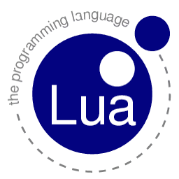

# A Re-structured Fork of Lua
![license-badge] ![c-badge] ![meson-badge]

<!-- PROJECT LOGO -->
 

  

  <h3 align="center">Lua Re-structured</h3>
  

    A Re-structured Fork of Lua's Mirrored Repository
     
    <a href="#how-to-use"><strong>Explore the docs »</strong></a>
     
     
    <a href="https://github.com/thiago-rezende/lua/issues">Report Bug</a>
    ·
    <a href="https://github.com/thiago-rezende/lua/issues">Request Feature</a>
  

<!-- Links -->

<!-- Badges -->
[license-badge]: https://img.shields.io/badge/license-MIT-blue.svg?style=flat-square
[meson-badge]: https://img.shields.io/badge/Meson-0.54.0-blueviolet.svg?style=flat-square
[c-badge]: https://img.shields.io/badge/C-99-blue.svg?style=flat-square
